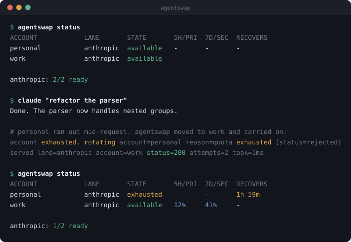

# agentswap

[](https://github.com/bojieli/agentswap/actions/workflows/ci.yml)
[](https://pkg.go.dev/github.com/bojieli/agentswap)
[](#security)
[](LICENSE)

**Keeps Claude Code and Codex going when the upstream says no.**

Your agent is twenty minutes into a refactor when the API says you are out of
quota for the next four hours. The session stops. You lose the context it built
up, and you start again later from a cold prompt.

`agentswap` is a small local proxy that stands between your CLI and the API. It
fails over to another of your own accounts, and when they are all spent it
*waits* instead of failing — because a request that arrives four minutes late is
worth more than one that fails now.

<p align="center">
  
</p>

Your CLI never sees the 429. It sees a slightly slower response.

## Install

```sh
go install github.com/bojieli/agentswap/cmd/agentswap@latest
```

Or take a binary — the script checks its checksum and refuses to install
without one:

```sh
curl -fsSL https://raw.githubusercontent.com/bojieli/agentswap/main/install.sh | sh
```

## Quick start

```sh
agentswap import           # adopt the login you already have
agentswap install          # point Claude Code and Codex at agentswap
agentswap service install  # run the daemon now, and again at every login
```

(`agentswap serve` runs it in the foreground instead, if you would rather watch
it.)

Then use your CLIs exactly as before:

```sh
claude                          # picks up the settings automatically
codex --profile agentswap       # Codex needs the profile flag
```

That is one account, which is not yet failover. Sign in as another and pool it:

```sh
agentswap login --id work
```

`login` tells you what to sign in to, waits for you to do it, and adopts the
result. The same account is never pooled twice.

An imported credential is a copy of the one your CLI is using, and whichever of
you renews first retires the other's. For the account you use every day, pool a
token that is nobody's session:

```sh
claude setup-token                 # issue a long-lived token
agentswap add-token anthropic      # pool it; it will not go stale
```

API keys — your own, or a company gateway that speaks the same protocol — are
tried after every subscription is spent:

```sh
agentswap add-key anthropic                     # prompts, with the echo off
agentswap add-key anthropic --key - --id corp \
  --base-url https://llm.corp.example.com
```

Then `agentswap status` to see the pool, and `agentswap doctor` if anything
looks wrong. Full walkthrough: [docs/accounts.md](docs/accounts.md).

## What makes it different

Rotating between accounts is the easy part, and several tools do it. The
difference is what happens at the edges, where an agent session actually dies.

**It waits instead of failing.** When every account is spent, the request is
parked — held open, with no bytes written — until quota comes back. Everything
else surfaces the error, which is the thing that ends the session.

**It survives a wait too long to hold a socket.** Past a configurable ceiling
it hands off to `agentswap run`, which waits out the reset and resumes the
session with `claude --continue` or `codex exec resume --last`, so the agent
picks up where it stopped instead of repeating your instruction.

**It moves before the refusal, not after.** Anthropic returns quota headers on
*successful* responses, so an account is retired at 98% rather than after it
starts failing. Nothing is spent discovering the limit.

**It knows when *not* to rotate.** Prompt caches are per-account, so rotating on
a throttle that lifts in twenty seconds turns cache hits into full-price misses.
Conversations stay pinned to one account until it is genuinely spent — naive
rotation quietly costs you money.

**It retries an overloaded server forever.** A 529 is temporary; giving up on it
is what strands the agent mid-task.

**It tells you the one thing you have to act on.** A revoked login is the only
failure that will not fix itself, and the error your agent shows names the
account and the exact command:

```
your anthropic account "work" was rejected (refresh failed with 401
Unauthorized). Sign in again with `agentswap login --id work`.
```

It is also not a fork and not a harness. Both CLIs already support pointing at a
different base URL, so agentswap is pure configuration to them and keeps working
as they change.

> **Status: early.** The core is covered by unit and end-to-end tests, but this
> has not been through a long soak against real accounts. Treat it as beta.

## How it decides

Three failures arrive as a 429 or a 5xx and each needs the opposite response.
Confusing them is why naive rotation performs badly:

| Signal | What it means | What agentswap does |
| --- | --- | --- |
| 429, short `Retry-After` | per-minute throttle | wait, **same account** |
| 429, quota status rejected | window is spent | mark exhausted, **rotate now** |
| 529 / 5xx / `overloaded_error` | upstream capacity | **retry indefinitely**, backoff + jitter |
| 401 / 403 | stale token | refresh once, then retire the account |
| other 4xx | your request is wrong | pass straight through |

## Waiting without breaking the client

A parked request is held with **no bytes written** until quota returns. The
client is on loopback, so nothing in between can time out an idle socket, and
writing nothing means never committing to a status code that might have to be
taken back. `agentswap install` raises the CLI's own timeout to match.

Past `park.max_hold` (30 minutes by default) it gives up and returns a 503 with
`Retry-After`, on the theory that holding a socket for five hours is worse than
telling you when to come back. It also leaves a resume ticket, which is what
makes the supervisor work:

```sh
agentswap run -- claude "refactor the parser"
agentswap run -- codex exec "fix the failing tests"
```

`run` also sets the environment itself, so it works on a machine you never ran
`install` on, and adds `--profile agentswap` to Codex invocations — without it,
Codex silently bypasses the proxy.

## Moving a session to another coding agent

When a whole provider is unavailable — every account and key is spent, or you
simply want a model another harness exposes — the choice of harness belongs to
you. `agentswap` reports the exhaustion; it does not silently send a
conversation somewhere else.

From the project directory, move the newest session into a new native session:

```sh
agentswap teleport codex
agentswap teleport claude --from kimi --latest
agentswap teleport opencode --session <source-id>
agentswap teleport kimi --launch
```

Claude Code, Codex, OpenCode, and both current and legacy Kimi Code session
formats are supported as sources. All four are supported as targets. Discovery
uses an exact, symlink-aware match of the current directory, so worktrees and
neighboring packages in a monorepo do not get mixed. If several sessions match,
an interactive terminal gets a picker; scripts must use `--session`, `--from`,
or `--latest`.

Teleport translates the recorded structure — messages, recorded reasoning,
tool calls, call ids, JSON inputs, results and errors, plans, timestamps, and
model metadata — instead of turning the conversation into one summary prompt.
It validates the entire source before touching the target and never modifies
the source. `--dry-run` performs that validation without writing anything.
OpenCode database changes go through OpenCode's own `export` and `import`
commands rather than writing its SQLite database directly.

Current Kimi Code restores the agent profile bound to a session instead of
silently applying a new global default. For imported history, the exact resume
command therefore includes `--model` using Kimi's configured `default_model`;
set `AGENTSWAP_KIMI_MODEL` to choose another target alias.

This is a continuation, not process migration. Provider KV caches, hidden or
encrypted reasoning, unrecorded system prompts, credentials, approvals, live
shell processes, background tasks, and in-memory plugin state cannot move.
Provider-signed reasoning becomes ordinary recorded content where necessary,
with a warning. Text-file context is retained as visible text; media, branched
subagent transcripts, or an unknown conversation-bearing schema fail closed
rather than creating a target that only looks resumable. See the exact command
and format contract in [docs/commands.md](docs/commands.md#agentswap-teleport-target).
For a real four-harness acceptance matrix, see
[docs/teleport-live-acceptance.md](docs/teleport-live-acceptance.md).

## Configuration

```sh
agentswap config          # where everything lives, and the values in effect
agentswap config --write  # save those values as a file to edit
```

`~/.config/agentswap/config.json` — every field has a working default:

```json
{
  "addr": "127.0.0.1:8420",
  "rotation": { "drain_above": 98, "sticky": true, "sticky_ttl": "30m" },
  "retry":    { "burst_cutoff": "2m", "overload_initial": "1s",
                "overload_max": "1m", "rotate_after": 3 },
  "park":     { "enabled": true, "buffer": "1m", "max_hold": "30m",
                "keepalive": "silent" }
}
```

Accounts are not configured here. They are commands, because OAuth tokens are
rewritten under you as they refresh — `agentswap set` changes an account's
upstream, priority or label. Every field and what it costs to get wrong:
[docs/configuration.md](docs/configuration.md).

## Files it touches

| Path | What |
| --- | --- |
| `~/.config/agentswap/accounts.json` | the credential pool, mode 0600 |
| `~/.config/agentswap/state.json` | observed quota and health |
| `~/.claude/settings.json` | an `env` block, merged key by key |
| `~/.codex/config.toml` | an additive, delimited provider + profile block |

`teleport` additionally creates one new native target session under the
target's own session root (`~/.claude/projects`, `~/.codex/sessions`,
`~/.kimi-code/sessions`, or legacy `~/.kimi/sessions`). OpenCode is updated
through `opencode import`. These are conversation files and can contain source
code, prompts, and tool output; they receive the target CLI's normal private
permissions. The source session is read-only.

The last two follow `CLAUDE_CONFIG_DIR` and `CODEX_HOME` when you have set them,
since the CLIs themselves do. Both are backed up before any change and restored
exactly by `agentswap uninstall`, which removes only values it recognises as its
own.

## Security

agentswap holds live OAuth tokens, so it has **no third-party dependencies** —
nothing in this process comes from outside the Go standard library, and CI fails
if `go.sum` stops being empty. It listens on loopback only, and credential files
are written 0600 via atomic replace.

The proxy discards whatever credential the client sends and substitutes one from
the pool, so a token cannot leak from one configured CLI into another lane.

It also checks the `Host` header. A page you visit can point its own domain at
127.0.0.1 and post to a local server — DNS rebinding — and agentswap would
otherwise answer with real credentials. What rebinding cannot forge is the
`Host` header, so unrecognised names are refused.

Full threat model and how to report something: [SECURITY.md](SECURITY.md).

## Terms of service — read this

Using several subscriptions to increase throughput may violate Anthropic's or
OpenAI's terms, and accounts have reportedly been banned over unusual OAuth
patterns.

agentswap is **failover-only by design**: exactly one account is ever in flight,
and it moves only when the current one is genuinely refused. It never runs
accounts in parallel to multiply throughput. That is a more defensible posture
than round-robin pooling, but it is not legal advice, and whether your usage is
permitted is your call about your own accounts.

## Limitations

- A stream that fails **after** partial output cannot be transparently retried;
  those errors reach the client.
- Predictive rotation is Anthropic-only. Codex reports its quota inside the SSE
  stream rather than in headers, so that lane learns an account is spent from
  the 429.
- Codex needs `--profile agentswap`; it has no equivalent of Claude Code's
  automatic settings pickup.
- Automatic resume needs `agentswap run`. A bare `claude` gets the 503 and
  stops, because nothing is supervising it.
- agentswap has no OAuth flow of its own, so `agentswap login` guides a sign-in
  and adopts the result rather than signing you in.
- Session teleportation cannot transfer hidden provider/runtime state, active
  processes, credentials, or approvals. Unsupported conversation-bearing media
  fails closed, and every representational degradation is printed.
- OpenCode must be installed when it is a source or non-dry-run target, because
  its native import/export commands are the compatibility boundary.

## Prior art

[CC-Router](https://github.com/VictorMinemu/CC-Router),
[claude-swap](https://github.com/realiti4/claude-swap),
[teamclaude](https://github.com/KarpelesLab/teamclaude),
[cux](https://github.com/inulute/cux),
[llmux](https://github.com/2lab-ai/llmux) and
[coding_agent_account_manager](https://github.com/Dicklesworthstone/coding_agent_account_manager)
all rotate accounts, and the last covers Codex and Gemini too. If rotation is
all you need, use one of them. What is different here is in
[What makes it different](#what-makes-it-different): waiting through a reset
instead of surfacing it, resuming a session afterwards, reading quota before the
failure rather than after, and keeping conversations pinned so rotation does not
quietly cost you cache.

The offline session adapters build on format lessons from
[agent-migrator](https://github.com/builderpepc/agent-migrator),
[CatchUp](https://github.com/wilbeibi/catchup), and
[agent-teleport](https://github.com/tornikegomareli/agent-teleport), while
keeping the canonical event model and native writers in this dependency-free Go
binary. OpenCode's own import/export interface and Kimi Code's versioned wire
logs remain the authority for those formats.

## Documentation

- [Commands](docs/commands.md) — every command and flag, in one place
- [Accounts and keys](docs/accounts.md) — pooling logins, re-signing in, where
  keys live and why it is not one file
- [Configuration](docs/configuration.md) — every field, and what getting it
  wrong costs
- [Troubleshooting](docs/troubleshooting.md) — symptoms, causes, fixes
- [Architecture](docs/architecture.md) — how a request flows, and how to add a
  third lane
- [Contributing](CONTRIBUTING.md) — the one hard rule is no dependencies
- [Security](SECURITY.md) — threat model, and how to report privately

## License

MIT
